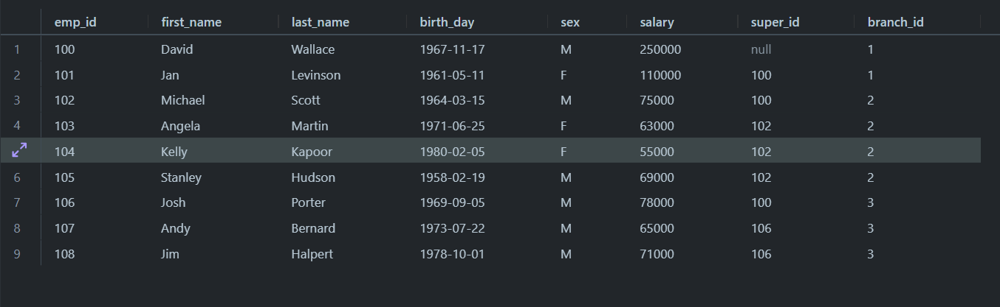
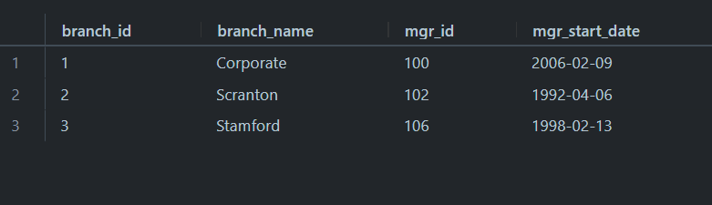
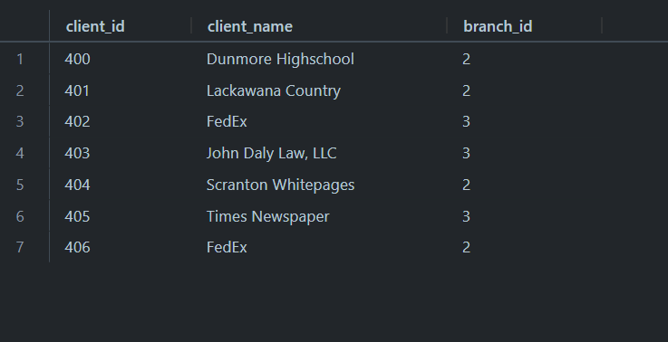
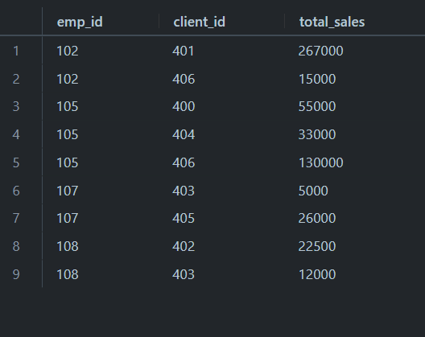
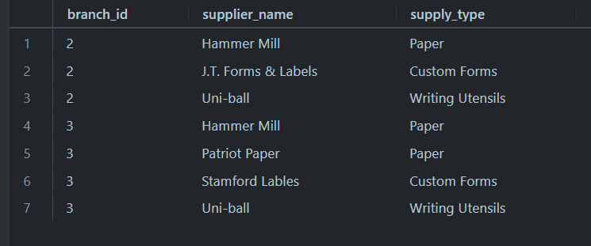

 

<h2 align="center">Here are the information about each table:</h2>

 
<h4 align="center">EMPLOYEE</h4>

  

 

 

<h4 align="center">BRANCH</h4>

  

 

 

<h4 align="center">CLIENT</h4>

  

 

 

<h4 align="center">WORKS WITH</h4>

  

 

 

<h4 align="center">BRANCH SUPPLIER</h4>

  

 

 
